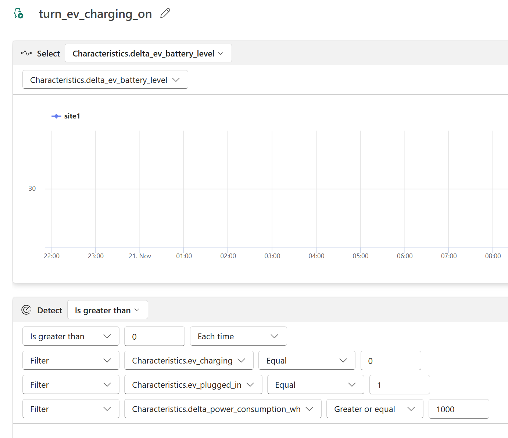
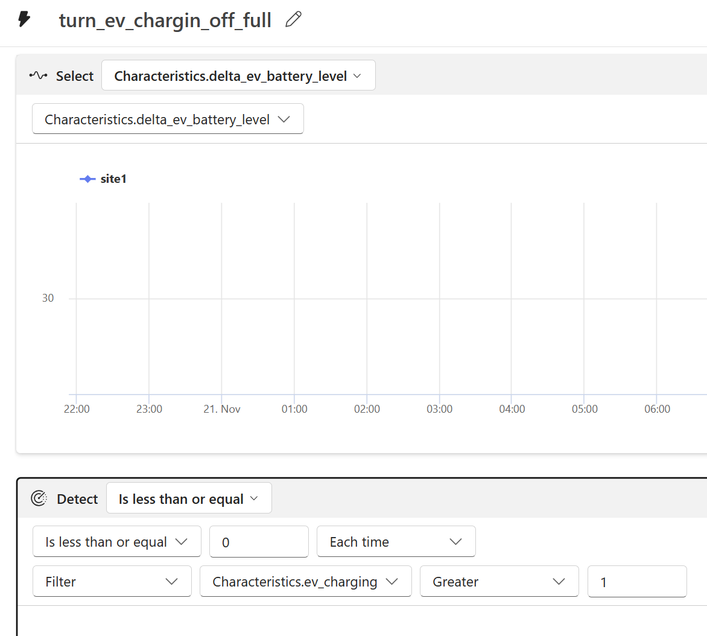
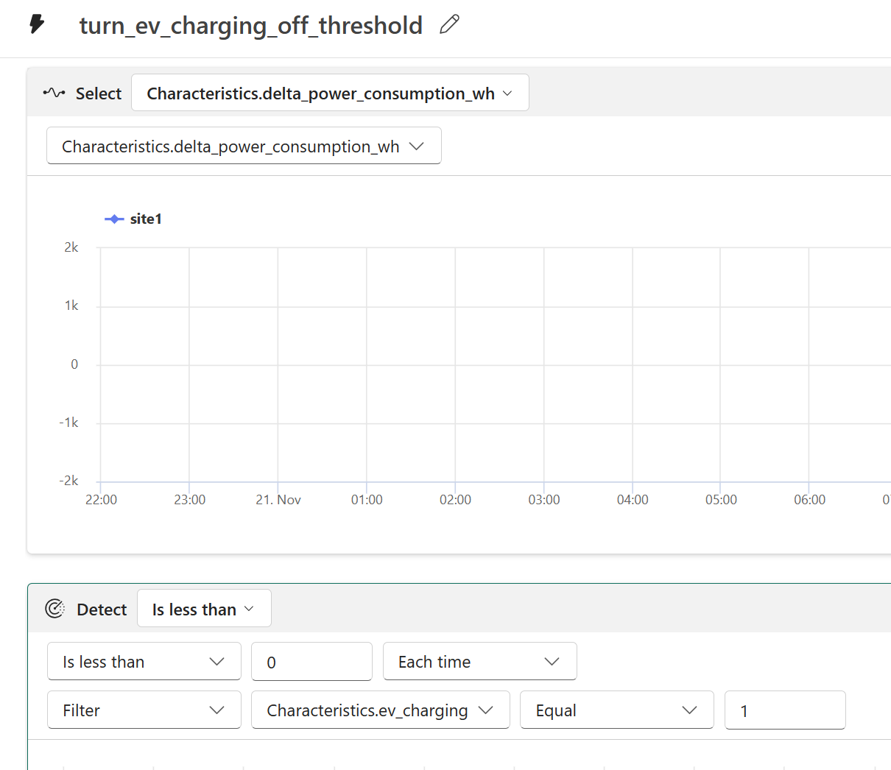
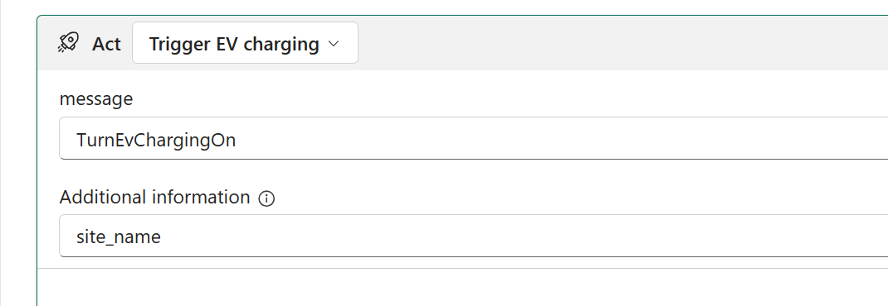
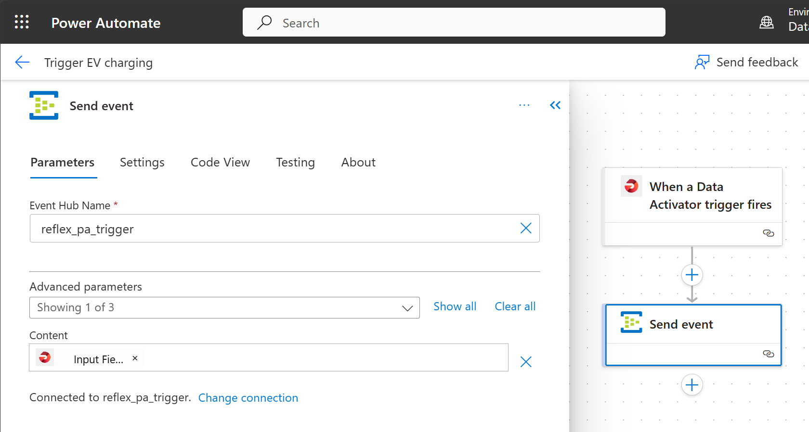

# Sample: Fabric streaming with Eventstream, Data Activator and KQL

> [!NOTE]
> This repository contains sample code and designs developed for demonstration purposes;
> is it not meant to be production-ready.

## Content of the repo

- **emulator**: A sample python script that generates telemetry for two devices from a single site.
- **functions/enrichment**: Azure Function with Eventhub trigger that enriches event streamed over Eventstream
- **functions/trigger**: Azure Function with Eventhub trigger that listens on Eventhub and sends events back to the emulator via Eventream.
- **KQL Schema.sql**: Minimal KQL schema used for the sample. It contains telemety table, lookup tables for devices and site configuration, and two functions used during lookup by the enrichment function.

## Architecture

## Reflex configuration

The Reflex is configured to consume telemetry with the Site name ad the key column.

There are three triggers.

Trigger to turn on charging when the EV is plugged in, the batter is lower than the desired level and the power consumption is below a defined threshold:

Trigger to turn off charging when the battery reaches the desired level:

Trigger to turn off charging when the power consumption exceeds a predefined threshold.

All triggers use the same custom action to send a message via the same Power Automate flow:

The Power Automate Flow in turns sends the content of the event to an Eventhub that is consumed by the trigger functions to send events back to the emulator.
